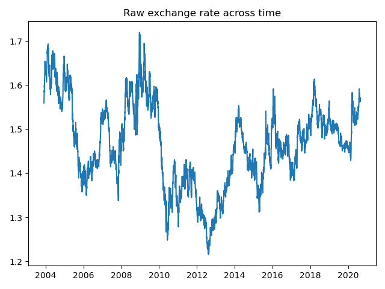

# My journey to predict currency rate with RNNs, to dive into the problematics of the time serie forcasting field
## Following this article, you will follow my process of development and thinking, step by step, explained.

The concept goal of this project is to try to predict the currency rate of the EUR-CAD currencies. I know that it is not a easy feasible goal 
(otherwise every Data Scientist would quit and have a bot to trade).

I would consider the project a success, not be to have a perfect model, but to try a lot of technical stuff to get use to it and understand it.
To start easily, it is to predict the closing price of the day, knowing all the previous prices, to guess if this is a right time to convert money or not.

The technological goal of this project is for me, to use Pytorch with Tensorboard, and to learn and apply RNNs and other forecasting methods on a real use case like ARIMA. 
At the end, if the results are interesting, I may try to create a fully automated webapp to deploy the model online that tell you when to buy or sell. 

### Data Gathering
The first step is to retrieve the data. There is a lot of databases and csv around, but I wanted to get up-to-date data and practice my web scrapping
I went to Yahoo finance website and figured out that they have a specific button to download the data they display as a CSV.

I quickly saw that they trigger the request with two parameters, the starting and ending date as [Unix time](https://en.wikipedia.org/wiki/Unix_time) so I put "0" and "9999999999999" as first and last : 
`https://query1.finance.yahoo.com/v7/finance/download/EURCAD=X?period1=0&period2=9999999999999&interval=1d&events=history`

### Data Preparation
There are NaN values in the dataset, when the market is closed (Sunday, and some other specific days like public holiday). 
I chose to use the previous day value to fill the NaN, because I did not wanted to lose the week periodicity that could be helpful.

When I read articles about guessing exchange rate or stock values, too many writers implement a simple LSTM, run it,
and show a plot that seems to predict really good like this (and finish their tutorial/article with this illusion):

The illusion is working, but the model is really bad. You feed for example with the nth - 10 to nth value to predict the n+1. 
It predict the n+1 as approximately the nth value, that's it, nothing smart. This is why you have a 1 day/1 point delay in the graph.

To avoid this pitfall, **I thought about taking only a delta with the previous day** instead of the raw value, but it failed really bad.
I did some tries but I found later that you lose too much information (min/max values of a specific time period that will "block" the value because of mass market rules). 

To avoid this 1 day lag, I do not have the answer yet, but instead of predicting only the next day, we may train using the previous predicted value,
and try to predict the n + 2 and so on. You avoid the pitfall like this.

What I finished to do was to keep the raw value but normalize it (0 as lowest value -10% and 1 as biggest value + 10%). 
Why 10% ? Because I wanted to have a margin in case the value break it's all time maximum or minimum, but it does not totally answer the issue : 
What about if the value goes above 10% ? My model would not work at all. I may dig later on this small problem. 

So this was my data after normalization : 

So now my data are stationary, and are less prone to new extreme values never seen.

You then have to set a sliding window of the previous data to predict the next one.
For example, you have this serie : `[1,2,3,4,5,6,7,8,9]`

If you want to predict 1 value with the 4 previous ones, your sequence should be like : 

`[1,2,3,4]` and target value is `5`

`[2,3,4,5]` and target valie is `6` and so on.

Do not forget that you cannot predict 1,2,3 or 4 because you do not have sufficient information previous.

To split, because it is a time serie, you should be careful and cut at a specific time, without shuffling the data before.
I chose to split 80% as train and 20% as test.

Now that I have my data cleaned and reformatted, I can start building my models.

N.B. : I am used to do data augmentation so I thought about augment my data with small random noise in the data,
really small decimal but at this point, it did not helped.

### Model Creation

I created 3 models to test and compare : LSTM, GRU and ARIMA

LSTM and GRU are two Recurrent Neural Networks, and ARIMA is a statistical model for forecasting, for data that are non stationary.

For the LSTM and GRU, I implement basic layers with Pytorch, with simple architecture : 
- 1 hidden layer
- Hidden layers of 256 neurons
- MSE loss
- Adam optimizer

And I tried to train them. Now this is the tricky part and the disappointment part !

### Training of the models

I used tensorboard to keep a track of the trains. 

I used text panel to store the differents parameters I play with (Learning rate, batch size, epoch...)

I plot the train and test loss curves, and when the training is finished, I plot the prediction over the test set and the corresponding truth. 
Because I don't do early stopping, the test loss is not taking into into account and doesn't leak. 
Otherwise I should have a third set of validation to predict at end of training.

